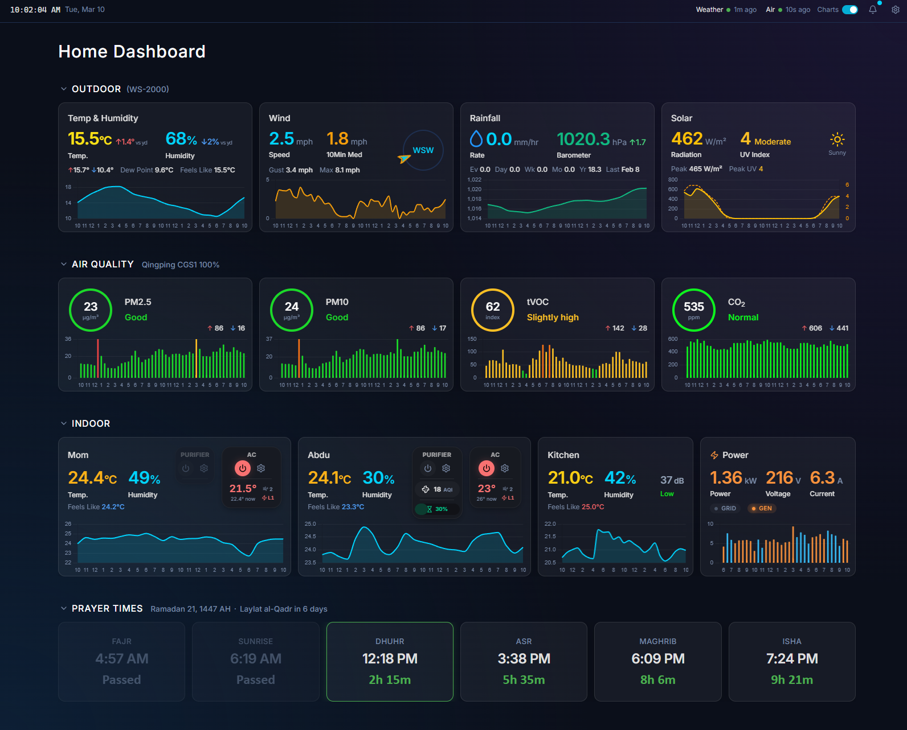

# Home Dashboard

> Real-time home environmental monitoring & smart device control




## Features

- Live outdoor weather monitoring — temperature, humidity, wind, rain, pressure, UV, solar radiation
- Indoor climate tracking across multiple rooms with historical charts
- Air quality metrics — CO2, PM2.5, PM10, tVOC, noise levels with color-coded severity
- Xiaomi air purifier control with auto/manual modes, fan levels, and filter status
- TCL split AC control — temperature, mode, fan speed, swing, eco/turbo toggles
- Metric-based & scheduled automations (e.g., PM2.5 > 50 → turn on purifier)
- ESP power monitoring with grid/generator source detection and usage charts
- Push notifications with configurable alerts (sensor thresholds + prayer times)
- Admin/guest access control — indoor section & device controls gated behind cookie-based JWT auth
- Dark-themed responsive UI with live-updating cards and smooth Chart.js visualizations

## Hardware

| Device | Data |
|--------|------|
| **Ambient Weather WS-2000** | Outdoor weather + indoor console + CH8 remote sensor |
| **Qingping CGS2 Air Monitor** | CO2, PM2.5, PM10, tVOC, noise, temp, humidity |
| **Xiaomi Mi Air Purifier** ×2 | v7 (MiIO) + vb2 (MIoT) — automated via cloud API |
| **TCL Split AC** ×3 | Cloud-controlled via reverse-engineered TCL Home API |
| **ESP Power Monitor** | Mains voltage + current on two lines (grid / generator) |

## Architecture

```
Browser → Cloudflare → Traefik (VPS) → Dashboard Container (port 8000)
                                              │
                                              ├── Express API + Static Frontend
                                              ├── Collector (AW polling + MQTT + automations)
                                              └── PostgreSQL (shared, db=home)
```

## Tech Stack

| Backend | Frontend |
|---------|----------|
| Express 5 (Node.js 22) | React 19 + Vite 7 |
| TypeScript 5 | Tailwind CSS 4 |
| PostgreSQL 16 (BRIN indexes) | Chart.js 4 + react-chartjs-2 |
| MQTT 5 (Mosquitto broker) | Lucide React icons |
| Web Push (VAPID) | date-fns |
| xmihome (Xiaomi Cloud) | Service Worker (push notifications) |
| AWS IoT (TCL AC shadow) | |

## Project Structure

```
├── server/src/
│   ├── index.ts            # Express app, static serving, collector startup
│   ├── routes.ts           # REST API endpoints
│   ├── auth.ts             # JWT auth (HMAC-SHA256), cookie middleware, requireAuth guard
│   ├── collector.ts        # Sensor polling, MQTT, automation loop
│   ├── database.ts         # PostgreSQL pool, schema, migrations
│   ├── xiaomi-cloud.ts     # Xiaomi device discovery & control
│   ├── tcl-cloud.ts        # TCL AC cloud API (auth, shadow, control)
│   └── alert-metrics.ts    # Metrics catalog, prayer time labels
├── client/src/
│   ├── App.tsx             # Root component with tab navigation
│   ├── components/         # Cards, charts, modals, widgets
│   ├── hooks/              # Data fetching, clock, flash, alerts
│   ├── types/              # API type definitions
│   └── constants/          # Thresholds, chart utils, helpers
├── mosquitto/              # MQTT broker configuration
├── Dockerfile              # Multi-stage build (client → server → production)
└── docker-compose.yml      # Dashboard + Mosquitto services
```

## Getting Started

### Prerequisites

- Node.js 22+
- Docker & Docker Compose (for production)
- PostgreSQL 16 (or use the Docker setup)
- Mosquitto MQTT broker (included in compose)

### Environment Variables

| Variable | Description |
|----------|-------------|
| `DATABASE_URL` | PostgreSQL connection string |
| `AW_API_KEY` | Ambient Weather API key |
| `AW_APP_KEY` | Ambient Weather application key |
| `QP_APP_KEY` | Qingping app key |
| `QP_APP_SECRET` | Qingping app secret |
| `QP_DEVICE_MAC` | Qingping device MAC address |
| `MQTT_BROKER_URL` | MQTT broker connection URL |
| `MQTT_USERNAME` | MQTT broker username |
| `MQTT_PASSWORD` | MQTT broker password |
| `MI_EMAIL` | Xiaomi account email |
| `MI_PASSWORD` | Xiaomi account password |
| `MI_REGION` | Xiaomi server region (e.g., `sg`) |
| `TCL_USERNAME` | TCL Home account username |
| `TCL_PASSWORD` | TCL Home account password |
| `AUTH_SECRET` | HMAC-SHA256 secret for JWT signing (`openssl rand -hex 32`) |
| `ADMIN_USER` | Admin username |
| `ADMIN_PASSWORD` | Admin password |
| `VAPID_PUBLIC_KEY` | Web Push VAPID public key |
| `VAPID_PRIVATE_KEY` | Web Push VAPID private key |
| `VAPID_EMAIL` | Web Push contact email |

### Development

```bash
# Frontend dev server (proxies API to production)
cd client && npm install && npm run dev

# Type-check server
cd server && npm install && npx tsc --noEmit

# Type-check client
cd client && npx tsc -b
```

### Production (Docker)

```bash
docker compose up -d --build
```

The multi-stage Dockerfile builds the client (Vite), compiles the server (tsc), and produces a slim production image serving both on port 8000.

## API Overview

| Method | Endpoint | Description |
|--------|----------|-------------|
| `POST` | `/api/auth/login` | Admin login (sets httpOnly cookie) |
| `POST` | `/api/auth/logout` | Logout (clears cookie) |
| `GET` | `/api/auth/me` | Check auth status |
| `GET` | `/api/current` | Latest sensor readings |
| `GET` | `/api/current/power` | Current power readings |
| `GET` | `/api/history?range=24h` | Historical data (6h / 24h / 48h / 1w / 30d) |
| `GET` | `/api/solar-reference` | Solar radiation reference curve |
| `GET` | `/api/status` | System & collector status |
| `POST` | `/api/power/ingest` | ESP power data ingestion |
| `GET/POST` | `/api/alerts` | Alert rules CRUD |
| `PUT/DELETE` | `/api/alerts/:id` | Update / delete alert |
| `GET` | `/api/devices` | Xiaomi purifier devices |
| `POST` | `/api/devices/:id/control` | Purifier control commands |
| `GET/POST` | `/api/automations` | Automation rules CRUD |
| `PUT/PATCH/DELETE` | `/api/automations/:id` | Update / toggle / delete automation |
| `POST` | `/api/automations/:id/test` | Test automation action |
| `GET` | `/api/ac/devices` | TCL AC devices & state |
| `POST` | `/api/ac/devices/:id/control` | AC control commands |
| `POST` | `/api/push/subscribe` | Register push subscription |

## Deployment

```bash
# 1. Create deployment tarball
tar czf /tmp/home-deploy.tar.gz \
  --exclude='node_modules' --exclude='dist' --exclude='.git' \
  server client mosquitto Dockerfile docker-compose.yml

# 2. Upload to VPS
scp /tmp/home-deploy.tar.gz user@your-vps:/opt/home-dashboard/

# 3. Build and run
ssh user@your-vps "cd /opt/home-dashboard && \
  tar xzf /tmp/home-deploy.tar.gz && \
  docker compose up -d --build"
```

Vite adds content hashes to built assets — no manual cache busting needed.
